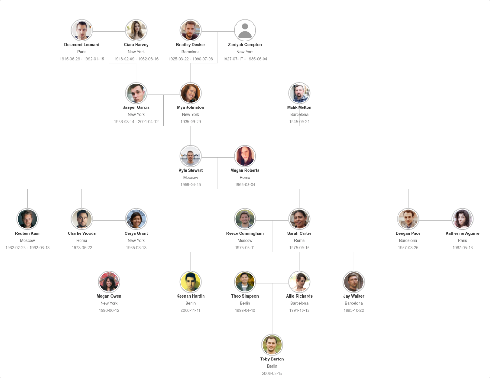

# FamilyTree SVG demo

An example of a relatives tree rendered with React into a SVG node:

## Modules

* [relatives-tree](https://www.npmjs.com/package/relatives-tree)
* [pinch-zoom-pan](https://www.npmjs.com/package/pinch-zoom-pan)
